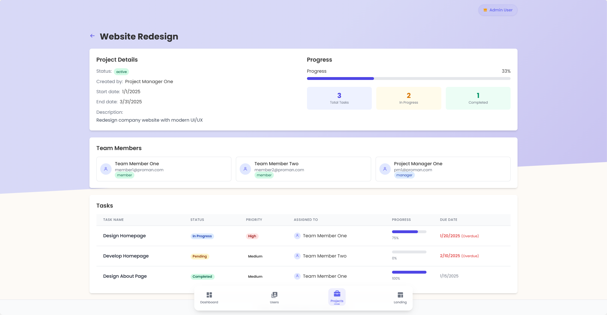
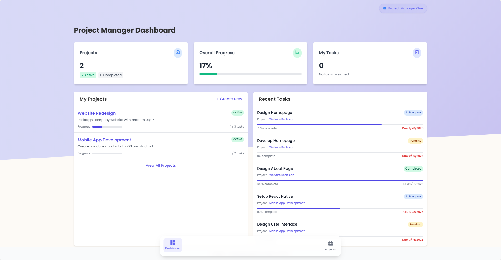
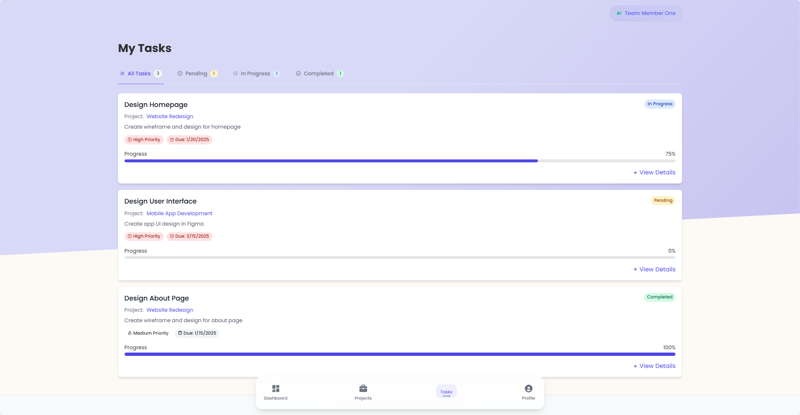
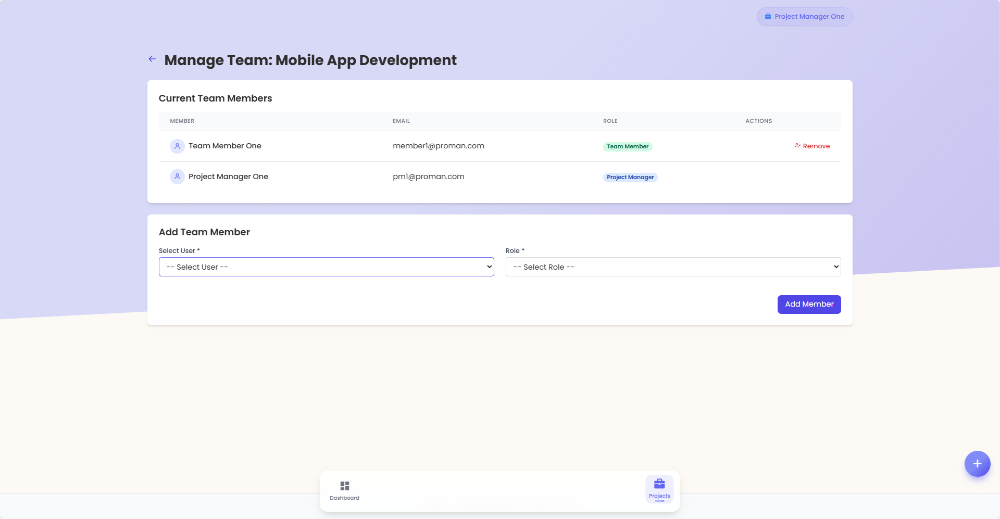

# 📚 ProMan - Project Management System
<p align="center">
  
  
  
  
  
  
</p>

> ProMan adalah sistem manajemen proyek modern dengan fitur kolaborasi tim, pelacakan tugas, dan komunikasi real-time. Dirancang dengan antarmuka yang responsif dan mudah digunakan, membantu tim mengatur proyek, mengelola anggota tim, dan memantau kemajuan proyek secara efektif.

## ✨ Fitur Utama

<table>
  <tr>
    <td>📋 <b>Manajemen Proyek</b></td>
    <td>Buat, edit, dan pantau proyek dengan timeline dan milestone yang jelas</td>
  </tr>
  <tr>
    <td>👥 <b>Manajemen Tim</b></td>
    <td>Kelola anggota tim dan tetapkan peran untuk setiap proyek</td>
  </tr>
  <tr>
    <td>✅ <b>Pelacakan Tugas</b></td>
    <td>Buat, tetapkan, dan pantau tugas dengan status dan prioritas</td>
  </tr>
  <tr>
    <td>💬 <b>Komunikasi Real-time</b></td>
    <td>Diskusi dan notifikasi instan melalui integrasi Socket.io</td>
  </tr>
  <tr>
    <td>📊 <b>Dashboard Analitik</b></td>
    <td>Visualisasi data proyek dan kinerja tim</td>
  </tr>
</table>

## 🖼️ Preview Aplikasi

> Preview dari #ProMan Project Management System

<div align="center">
  
  
  
  
</div>

## 🧩 Teknologi yang Digunakan

- **Backend**: Node.js + Express.js untuk server yang cepat dan efisien
- **View Engine**: Pug templating untuk rendering HTML yang elegan
- **Styling**: Tailwind CSS untuk desain yang modern dan responsif
- **Database**: SQLite3 (file-based) untuk penyimpanan data yang ringan
- **Real-time**: Socket.io untuk komunikasi dan notifikasi real-time
- **Authentication**: bcrypt untuk enkripsi password dan manajemen sesi

## 👥 Role Pengguna

<details>
  <summary><b>🛡️ Admin</b></summary>
  <ul>
    <li>Mengelola semua pengguna sistem</li>
    <li>Membuat dan mengelola proyek</li>
    <li>Menetapkan Project Manager untuk proyek</li>
    <li>Melihat laporan dan analitik semua proyek</li>
    <li>Mengatur konfigurasi sistem</li>
  </ul>
</details>

<details>
  <summary><b>👨‍💼 Project Manager (PM)</b></summary>
  <ul>
    <li>Mengelola proyek yang ditugaskan</li>
    <li>Menambah dan menghapus anggota tim proyek</li>
    <li>Membuat dan menetapkan tugas kepada anggota tim</li>
    <li>Memantau kemajuan proyek dan kinerja tim</li>
    <li>Mengupdate status proyek dan milestone</li>
  </ul>
</details>

<details>
  <summary><b>👨‍💻 Team Member</b></summary>
  <ul>
    <li>Melihat tugas yang ditugaskan</li>
    <li>Mengupdate status dan progress tugas</li>
    <li>Berkolaborasi dengan anggota tim lain</li>
    <li>Menambahkan komentar pada tugas</li>
    <li>Melihat timeline dan milestone proyek</li>
  </ul>
</details>

## 🚀 Cara Instalasi

1. Clone repository ini
   ```bash
   git clone https://github.com/andi-nugroho/pro-man.git
   cd pro-man
   ```

2. Install dependencies
   ```bash
   npm install
   ```

3. Inisialisasi database dengan data awal
   ```bash
   npm run seed
   ```

4. Jalankan aplikasi
   ```bash
   npm start
   ```
   atau untuk development
   ```bash
   npm run dev
   ```

6. Akses aplikasi melalui browser di `http://localhost:3000`

## 🔑 Default Login

| Role          | Username        | Password  |
|---------------|----------------|-----------|
| Admin         | admin          | password123  |
| Project Manager | manager      | password123  |
| Team Member   | member         | password123 |

## 🗺️ Routes & API Endpoints

<details>
  <summary><b>🔐 Authentication Routes</b></summary>

  - `GET /auth/login` - Menampilkan halaman login
  - `POST /auth/login` - Memproses login user
  - `GET /auth/logout` - Logout user dan menghapus sesi
  - `GET /auth/register` - Menampilkan halaman registrasi
  - `POST /auth/register` - Memproses registrasi user baru
</details>

<details>
  <summary><b>🏠 Landing Routes</b></summary>

  - `GET /` - Halaman utama/landing page
</details>

<details>
  <summary><b>🛡️ Admin Routes</b></summary>

  ### Page Routes
  - `GET /admin/dashboard` - Dashboard admin
  - `GET /admin/users` - Manajemen pengguna
  - `GET /admin/projects` - Manajemen proyek
  - `GET /admin/projects/create` - Form pembuatan proyek baru
  - `GET /admin/projects/:id` - Detail proyek
  - `GET /admin/projects/:id/edit` - Form edit proyek
  - `GET /admin/analytics` - Analitik dan laporan

  ### API Routes - Users
  - `GET /admin/api/users` - Mendapatkan semua data pengguna
  - `POST /admin/api/users` - Membuat pengguna baru
  - `PUT /admin/api/users/:id` - Mengubah data pengguna
  - `DELETE /admin/api/users/:id` - Menghapus pengguna

  ### API Routes - Projects
  - `GET /admin/api/projects` - Mendapatkan semua data proyek
  - `POST /admin/api/projects` - Membuat proyek baru
  - `PUT /admin/api/projects/:id` - Mengubah data proyek
  - `DELETE /admin/api/projects/:id` - Menghapus proyek
  - `POST /admin/api/projects/:id/assign-pm` - Menetapkan Project Manager
</details>

<details>
  <summary><b>👨‍💼 Project Manager Routes</b></summary>

  ### Page Routes
  - `GET /pm/dashboard` - Dashboard Project Manager
  - `GET /pm/projects` - Daftar proyek yang dikelola
  - `GET /pm/projects/:id` - Detail proyek
  - `GET /pm/projects/:id/edit` - Form edit proyek
  - `GET /pm/projects/:id/members` - Manajemen anggota tim proyek
  - `GET /pm/projects/:id/tasks` - Daftar tugas proyek
  - `GET /pm/tasks/create` - Form pembuatan tugas baru
  - `GET /pm/tasks/:id/edit` - Form edit tugas
  - `GET /pm/tasks/:id` - Detail tugas

  ### API Routes - Project Management
  - `PUT /pm/api/projects/:id` - Mengupdate informasi proyek
  - `POST /pm/api/projects/:id/members` - Menambahkan anggota tim ke proyek
  - `DELETE /pm/api/projects/:id/members/:userId` - Menghapus anggota tim dari proyek

  ### API Routes - Task Management
  - `GET /pm/api/projects/:id/tasks` - Mendapatkan semua tugas dalam proyek
  - `POST /pm/api/tasks` - Membuat tugas baru
  - `PUT /pm/api/tasks/:id` - Mengupdate tugas
  - `DELETE /pm/api/tasks/:id` - Menghapus tugas
  - `POST /pm/api/tasks/:id/assign` - Menetapkan tugas ke anggota tim
</details>

<details>
  <summary><b>👨‍💻 Team Member Routes</b></summary>

  ### Page Routes
  - `GET /member/dashboard` - Dashboard anggota tim
  - `GET /member/projects` - Daftar proyek yang diikuti
  - `GET /member/projects/:id` - Detail proyek
  - `GET /member/tasks` - Daftar tugas yang ditugaskan
  - `GET /member/tasks/:id` - Detail tugas
  - `GET /member/profile` - Profil pengguna

  ### API Routes - Task Management
  - `GET /member/api/tasks` - Mendapatkan semua tugas yang ditugaskan
  - `PUT /member/api/tasks/:id/status` - Mengupdate status tugas
  - `PUT /member/api/tasks/:id/progress` - Mengupdate progress tugas
  - `POST /member/api/tasks/:id/comments` - Menambahkan komentar pada tugas
</details>

## 📂 Struktur Project

```
proman/
├── app.js                # File utama aplikasi
├── config/               # Konfigurasi database dan aplikasi
│   └── seed.js           # Inisialisasi data awal
├── controllers/          # Logic aplikasi
│   ├── adminController.js
│   ├── authController.js
│   ├── landingController.js
│   ├── memberController.js
│   └── pmController.js
├── db/                   # Database SQLite
│   └── sessions.sqlite   # Database sesi
├── middleware/           # Middleware Express
│   └── auth.js           # Middleware autentikasi
├── models/               # Model data
├── public/               # Static assets (CSS, JS, gambar)
│   ├── css/
│   ├── js/
│   └── images/
├── routes/               # Route aplikasi
│   ├── admin.js
│   ├── auth.js
│   ├── landing.js
│   ├── project-manager.js
│   └── team-member.js
├── utils/                # Utility functions
│   └── socket.js         # Konfigurasi Socket.io
└── views/                # Template Pug
    ├── admin/
    ├── auth/
    ├── layouts/
    ├── member/
    ├── pm/
    └── partials/
```

## 🔄 Fitur yang Akan Datang

- 📱 Aplikasi mobile untuk akses di perangkat Android dan iOS
- 📊 Dashboard analitik yang lebih komprehensif
- 📅 Integrasi kalender untuk perencanaan proyek
- 📁 Manajemen file dan dokumen proyek
- 🌐 Integrasi dengan layanan pihak ketiga (GitHub, Slack, dll)

## 🤝 Kontribusi

Kontribusi selalu diterima! Silakan fork repositori ini, buat perubahan, dan kirimkan pull request.

## 📄 Lisensi

Proyek ini dilisensikan di bawah [MIT License](LICENSE).

📧 Untuk kerja sama komersial: dev.andinugroho@gmail.com
